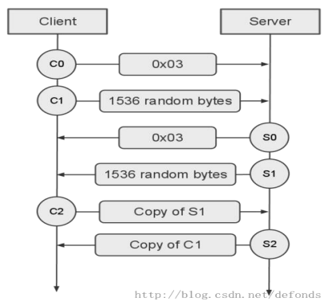

# RTMP Server with Golang

### 현재 진행중

- handshake - 완료
- chunk 단위로 요청 받아 연결 수립 - 진행중

## 간단한 RTMP 서버 구조 살펴보기

Go언어를 사용하여 간단한 RTMP 서버를 만들면서 구조에 대해 알아보겠습니다.

### TCP 연결

TCP 프로토콜을 사용하여 1935 포트에서 연결을 리스닝하고, 연결이 수립되면 각 연결을 처리하기 위해 고루틴(경량 스레드)을 생성합니다.

- 1935 포트는 RTMP 프로토콜의 기본 포트로 사용됩니다.

```go
func InitServer() {
    listener, err := net.Listen("tcp", ":1935")
    ctx := initStreamContext()
    for {
        conn, err := listener.Accept()
        connection := connect.NewConnection(conn, ctx)
        go connection.Serve()
    }
}
```

### Handshake



RTMP(Real Time Messaging Protocol) 프로토콜에서의 핸드셰이크 과정은 클라이언트와 서버 간의 연결을 초기화하고, 신뢰성 있는 스트림 전송을 준비하는 중요한 단계입니다.

**C0 패킷**

C0 패킷은 클라이언트가 서버에 보내는 첫번째 바이트로, 사용할 RTMP 프로토콜의 버전을 지정합니다. (1 바이트)

보내지는 값은 일반적으로 '0x03'으로 RTMP 프로토콜의 버전 3을 의미합니다. (표준 버전)

그러나 암호화를 사용하는 경우 (예를 들어 RTMPE) '0x06'과 같은 다른 값이 사용될 수 있습니다.

```go
type C0Data struct {
    Version uint8
}

func (h *HandShake) C0() (err error) {
    c0 := make([]byte, 1)
    if _, err = h.Conn.Read(c0); err != nil {
        log.Printf("Failed to read C0: %+v", err)
        return
    }
    h.C0Data.Version = c0[0]
    log.Printf("Reading C0 version %v", c0[0])
    return
}
```

**S0 패킷**

S0 패킷은 서버에서 클라이언트로 보내는 첫번째 바이트로, 서버가 사용하는 RTMP 프로토콜의 버전을 지정합니다. (1 바이트)

이 바이트는 클라이언트가 전송한 C0단계와 일치해야 통신이 원할하게 이루어질 수 있습니다.

일반적으로 서버도 '0x03'값을 사용하여 RTMP 프로토콜의 표준 버전인 버전 3을 사용하고 있음을 나타냅니다.

```go
type S0Data struct {
    Version uint8
}

func (h *HandShake) S0() (err error) {
    s0 := []byte{0x03}
    if _, err = h.Conn.Write(s0); err != nil {
        log.Printf("Failed to write S0: %+v", err)
        return
    }
    h.S0Data.Version = s0[0]
    log.Printf("Writing S0 version %v", s0[0])
    return
}
```

C0 패킷과 S0 패킷은 서버와 클라이언트가 사용하는 프로토콜의 버전을 확인하는 중요한 단계입니다.

**C1 패킷**

C1 패킷은 클라이언트가 서버로 보내는 두 번째 메세지로, 보다 구체적인 연결 정보를 제공합니다. (1536 바이트)

- 타임 스탬프 (4 바이트): 클라이언트가 C1 패킷을 생성한 시간을 기록합니다. 네트워크 지연 측정과 동기화에 사용됩니다.
- 제로 (4 바이트): 초기 RTMP 사양에서는 이 부분이 사용되지 않고 0으로 설정됩니다.
- 랜덤  데이터 (1528 바이트): 보안을 강화하고 연결 중 잠재적인 공격자로부터의 위협을 방지하는 데 사용됩니다.

```go
type C1Data struct {
    Timestamp uint32
    Zero      uint32
    Random    []byte
}

func (h *HandShake) C1() (err error) {
    c1 := make([]byte, 1536)
    if _, err = h.Conn.Read(c1); err != nil {
        log.Printf("Failed to read C1: %+v", err)
        return
    }
    h.C1Data.Timestamp = binary.BigEndian.Uint32(c1[:4])
    h.C1Data.Zero = binary.BigEndian.Uint32(c1[4:8])
    h.C1Data.Random = c1[8:]
    log.Printf("Reading C1 message: timestamp=%v, zero=%v, random data length=%d", h.C1Data.Timestamp, h.C1Data.Zero, len(h.C1Data.Random))
    return
}
```

**S1 패킷**

S1 패킷은 서버에서 클라이언트로 보내는 두 번째 메세지로, 보다 구체적인 연결 정보를 제공합니다. (1536 바이트)

- 타임 스탬프 (4 바이트): 서버가 S1 패킷을 생성한 시간을 기록합니다. 네트워크 지연 측정과 동기화에 사용됩니다.
- 제로 (4 바이트): 초기 RTMP 사양에서는 이 부분이 사용되지 않고 0으로 설정됩니다.
- 랜덤  데이터 (1528 바이트): 보안을 강화하고 연결 중 잠재적인 공격자로부터의 위협을 방지하는 데 사용됩니다.

```go
type S1Data struct {
    Timestamp uint32
    Zero      uint32
    Random    []byte
}

func (h *HandShake) S1() (err error) {
    s1 := make([]byte, 1536)
    currentTime := uint32(time.Now().Unix())
    binary.BigEndian.PutUint32(s1[0:4], currentTime)
    zero := uint32(0)
    binary.BigEndian.PutUint32(s1[4:8], zero)
    
    // 랜덤 데이터 생성
    randBytes := make([]byte, 1528)
    _, err = rand.Read(randBytes)
    if err != nil {
        return
    }
    copy(s1[8:], randBytes)
    _, err = h.Conn.Write(s1)
    if err != nil {
        return
    }
    h.S1Data.Timestamp = currentTime
    h.S1Data.Zero = zero
    h.S1Data.Random = randBytes
    log.Printf("Writing S1 message: timestamp=%v, zero=%v, random data length=%d", currentTime, zero, len(randBytes))
    return
}
```

**C2 패킷**

C2 패킷은 클라이언트가 서버로부터 S1 패킷을 받은 후, 그에 대한 응답으로 서버에 보내는 패킷입니다. C2 패킷은 에코형 메시지로, 보통 S1 패킷의 내용을 그대로 반사(에코)하는 방식으로 구성됩니다.

서버는 C2 패킷의 내용을 검토하여 클라이언트가 S1 패킷을 올바르게 받았는지 검증할 수 있습니다. (연결 검증)

- 타임 스탬프 (4 바이트): S1에서 보낸 타임 스탬프를 에코합니다.
- 제로 or 타임스탬프 (4 바이트): S1에서 보낸 제로 값을 에코하거나, 클라이언트가 C2 패킷을 생성한 시간을 기록합니다.
- 랜덤  데이터 (1528 바이트): S1에서 보낸 랜덤 데이터를 에코합니다.

```go
type C2Data struct {
    S1Timestamp uint32
    S1Zero      uint32
    S1Random    []byte
}

func (h *HandShake) C2() (err error) {
    c2 := make([]byte, 1536)
    if _, err = h.Conn.Read(c2); err != nil {
        log.Printf("Failed to read C2: %+v", err)
        return
    }
    
    s1Timestamp := binary.BigEndian.Uint32(c2[:4])
    s1ZeroValue := binary.BigEndian.Uint32(c2[4:8])
    s1RandomData := c2[8:]
    
    if s1Timestamp != h.S1Data.Timestamp || !bytes.Equal(s1RandomData, h.S1Data.Random) {
        return fmt.Errorf("C2 validation failed: Echoed S1 timestamp or random data does not match")
    }
    
    h.C2Data.S1Timestamp = s1Timestamp
    h.C2Data.S1Zero = s1ZeroValue
    h.C2Data.S1Random = s1RandomData
    
    log.Printf("Reading C2 message: timestamp=%v, zero=%v, random data length=%d", s1Timestamp, s1ZeroValue, len(s1RandomData))
	return
}
```

**S2 패킷**

S2 패킷은 서바가 클라이언트로부터 C1 패킷을 받은 후, 그에 대한 응답으로 클라이언트에 보내는 패킷입니다. S2 패킷은 에코형 메시지로, 보통 C1 패킷의 내용을 그대로 반사(에코)하는 방식으로 구성됩니다.

클라이언트는 S2 패킷의 내용을 검토하여 서버가 C1 패킷을 올바르게 받았는지 검증할 수 있습니다. (연결 검증)

- C1 타임 스탬프 (4 바이트): C1에서 보낸 타임 스탬프를 에코합니다.
- 제로 or 타임스탬프 (4 바이트): C1에서 보낸 제로 값을 에코하거나, 서버가 S2 패킷을 생성한 시간을 기록합니다.
- 랜덤  데이터 (1528 바이트): C1에서 보낸 랜덤 데이터를 에코합니다.

```go
type S2Data struct {
    C1Timestamp uint32
    C1Zero      uint32
    C1Random    []byte
}

func (h *HandShake) S2() (err error) {
    s2 := make([]byte, 1536)
    binary.BigEndian.PutUint32(s2[:4], h.C1Data.Timestamp)
    binary.BigEndian.PutUint32(s2[4:8], h.C1Data.Zero)
    copy(s2[8:], h.C1Data.Random)
    
    if _, err = h.Conn.Write(s2); err != nil {
        return
    }
    
    h.S2Data.C1Timestamp = h.C1Data.Timestamp
    h.S2Data.C1Zero = h.C1Data.Zero
    h.S2Data.C1Random = h.C1Data.Random
    
    log.Printf("Writing S2 message: timestamp=%v, zero=%v, random data length=%d", h.C1Data.Timestamp, h.C1Data.Zero, len(h.C1Data.Random))
    return
}
```

핸드셰이크가 성공적으로 완료되면, 클라이언트와 서버는 세션을 설정하고 미디어 및 데이터 스트림 전송을 위한 준비를 하는 단계로 넘어갑니다.
